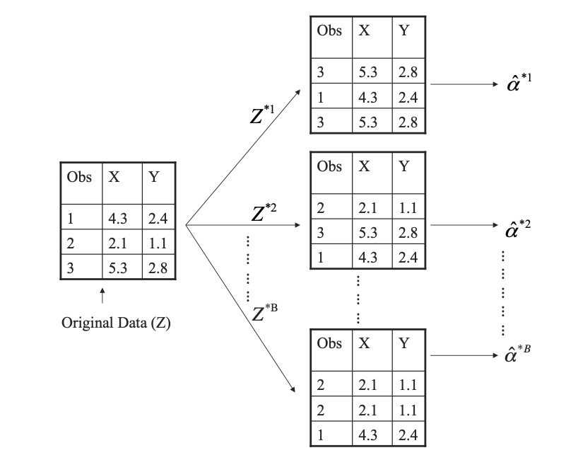

# 9: Resampling Methods (The Bootstrap)

```code
$ echo "Data Science Institute"
```

---

# Activity (15 minutes)

Watch this video up tp Bootstrapping part: https://www.youtube.com/watch?v=uGsf3spCM3Y

---

# The Bootstrap

Suppose we wish to find the average age of the population of Toronto $\mu$ and we have a sample of size $n$. We can find the mean of the sample $\mu_s$ but this does not give any indication for how this compares to the true population mean $\mu$.

---

# The Bootstrap

_**♦️The bootstrap can be used to quantify the uncertainty of an estimate♦️**_ in the following way:

-   Randomly sample $n$ observations from the original sample to acquire a new sample of the same size (repeat observations are allowed).

-   Compute the desired statistic (i.e. average age) of this new sample.

-   Repeat steps 1-2 many times.

-   Compute the standard error (SE) of the estimates.

This method is able to give us an estimate of the variability associated with our sample mean $\mu_s$.

---

# 



---


# Breakout Room

When should you use Bootstrapping over Cross Validation methods?

---

# Exercises: The Bootstrap

Open the The Bootstrap Jupyter Notebook file.

-   Go over the "The Bootstrap" section together as a class.

---

# `Portfolio` data in the `ISLP` package

Suppose that we wish to invest a fixed sum of money in two financial assets that yield returns of $X$ and $Y$ respectively, where $X$ and $Y$ are random quantities. We will invest a fraction $\alpha$ of our money in $X$, and will invest the remaining $1 − \alpha$ in $Y$ . Since there is variability associated with the returns on these two assets, we wish to choose $\alpha$ to minimize the total risk, or variance, of our investment. In other words, we want to minimize $\text{Var}(\alpha X + (1 − \alpha)Y)$. One can show that the value that minimizes the risk is given by:
$$
\alpha = \frac{\sigma_{Y}^2-\sigma_{XY}}{\sigma_{X}^2+\sigma_{Y}^2-2\sigma_{XY}}
$$
where $\sigma_{Y}^2 = \text{Var}(Y), \sigma_{X}^2 = \text{Var}(X), \sigma_{XY} = \text{Cov}(X,Y)$

---

# `Portfolio` data in the `ISLP` package

We can compute estimates for these quantities, $\hat{\sigma}_{X}^2, \hat{\sigma}_{Y}^2, \hat{\sigma}_{XY}$ using a data set that contains past measurements for $X$ and $Y$. We can then estimate the value
of $\alpha$ that minimizes the variance of our investment using:
$$
\hat{\alpha} = \frac{\hat{\sigma}_{Y}^2-\hat{\sigma}_{XY}}{\hat{\sigma}_{X}^2+\hat{\sigma}_{Y}^2-2\hat{\sigma}_{XY}}
$$
Our goal in this exercise is to estimate the sampling variance of the parameter $\alpha$ given in the formula above.

---

# References

Chapter 5 of the ISLP book:

James, Gareth, et al. "Resampling Methods." An Introduction to Statistical Learning: with Applications in Python, Springer, 2023.
